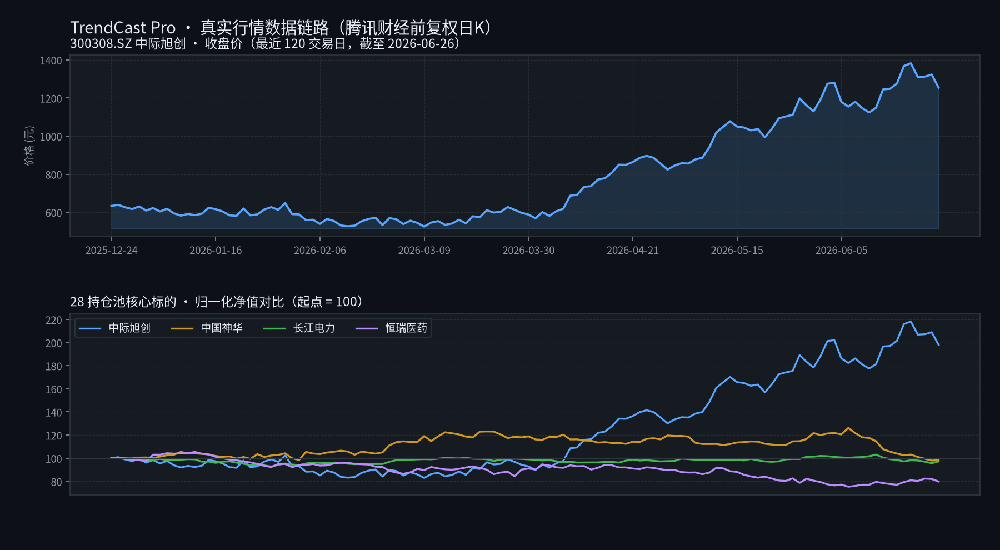

<div align="center">

# 📈 TrendCast Pro

### 金融市场预测模型 · v2.0.0

<p>
  <b>基于 LightGBM 梯度提升树的智能金融市场预测引擎</b><br/>
  <sub>多周期方向预测 · 真实行情数据链路 · 命中率审计 · 门禁与量尺治理</sub>
</p>


<br/><br/>

<!-- ── 状态 ── -->


<br/>

<!-- ── 技术栈 ── -->


<br/>

<!-- ── 数据源 ── -->


<br/>

<!-- ── 关键指标 ── -->


<br/>

<!-- ── 工程能力（S1~S15） ── -->


</div>

---

> 已作为**只读信号源**集成至外部独立仓库 **28-终极量化交易系统8.4**（不在本仓库内）：`daily_runner.py` 步骤 2.5 每日自动拉取预测，信号卡片进入每日报告，命中率由 28 本地真实行情回溯审计（设计见《为28终极量化交易系统提供策略决策依据_设计方案_20260909.md》）。

---

## 📑 目录

| | | |
|:---|:---|:---|
| [一、它做什么](#一它做什么) | [二、快速开始](#二快速开始) | [三、命令行接口](#三命令行接口) |
| [四、项目结构](#四项目结构) | [五、配置](#五配置) | [六、可选模型后端](#六可选模型后端) |
| [七、与主系统对接](#七与主量化系统的对接一期已交付并验证) | [八、测试](#八测试) | [九、已知限制](#九已知限制) |
| [十、研究进展](#十研究进展-s1s20--%EF%B8%8F) | [十一、技术栈](#十一技术栈) | [十二、免责声明](#十二免责声明) |
| [十三、许可证与版权](#十三许可证与版权) | | |

---

## 🖼️ 界面预览

<div align="center">

<table>
<tr>
<td width="50%"><br/><sub><b>真实行情数据链路</b> — 腾讯财经前复权日K + 归一化净值对比</sub></td>
<td width="50%"><br/><sub><b>模型评估面板</b> — 三周期六指标 + 波动率分位</sub></td>
</tr>
<tr>
<td width="50%"><br/><sub><b>预测控制台</b> — 组合级摘要 + CLI 速查（<i>按字段契约渲染的示例视图，非实时截图</i>）</sub></td>
<td width="50%"><br/><sub><b>端到端架构</b> — 五层结构与只读信号源集成</sub></td>
</tr>
</table>

</div>

---

---

## 一、它做什么 🎯

对 **A 股股票 / 商品期货 / 外汇** 标的，输出未来 **5 日（短期）/ 10 日（中期）/ 20 日（长期）** 的涨跌方向概率（二分类），并提供：

- 端到端流水线：数据采集 → 特征工程 → 训练 → 评估 → 导出 → 服务 → 报告
- 双维评估：机器学习指标（Accuracy / F1 / AUC）+ 金融指标（胜率 / 夏普 / 盈亏比 / 最大回撤）
- **推理数据每日自动刷新**：缓存过期经真实源刷新一次，绝不落 simulation 假数据（防随机游走数据伪装"今天"骗过新鲜度检查）
- FastAPI 预测服务（默认端口 8800），支持单只/批量/组合级预测（`/api/v1/portfolio/summary` 对齐 28 持仓池）
- 与 28 系统双向闭环：28 侧审计用本地真实行情回溯命中，命中率与漂移告警进入每日报告

### 📊 最新训练评估（2026-09-09，腾讯财经真实行情 · 目标泄漏已修复）

**数据口径**：28 持仓池 26 只标的（12 个股 + 14 ETF），腾讯财经前复权日K，2020-01-01 ~ 2026-09-09，按时间三段切分。

> ⚠️ 早期评估（2026-06-27，10d/20d AUC 0.84）存在**目标泄漏**（target 列曾混入特征集）与 simulation 模拟数据口径问题，属虚高值，不可比。下表为修复后（`get_feature_columns` 强制排除 `target_*`）的真实可信基线：

| 模型周期 | 准确率 | AUC | 胜率 | 盈亏比 | 夏普（近似） | 评级 |
|:---|:---:|:---:|:---:|:---:|:---:|:---|
| 短期 5d | 52.7% | 0.5688 | 52.7% | 1.11 | 0.39 | 弱（略优于随机） |
| 中期 10d | 53.2% | 0.5689 | 53.2% | 1.14 | 0.32 | 弱（略优于随机） |
| 长期 20d | 51.3% | 0.5420 | 51.3% | 1.05 | 0.09 | 接近随机 |

> 🧭 **结论**：真实行情下三周期区分度均有限（AUC 0.54~0.57），信号仅可作**只读观测参考**（一期口径），不可单独作为交易依据。
> 提升方向：宏观 / 情感 / 横截面特征扩充、按标的分层训练，命中率与 IC 达标后再进入决策路径
> （见《为28终极量化交易系统提供策略决策依据_设计方案_20260909.md》§5 / §6 二期门禁）。

### 🎛️ 核心能力

| 维度 | 说明 |
|:---|:---|
| 市场覆盖 | 28 持仓池 26 只标的（12 个股 + 14 ETF）+ **国内期货 10 只主连 + 外汇 2 只**（`configs/config_pro.yaml`）。期货/外汇经 **S14 akshare P1** 打通（此前因腾讯源不支持而关闭） |
| 预测周期 | short_term(5d) / mid_term(10d) / long_term(20d) |
| 模型 | LightGBM（主力）；TimesFM、Kronos 为可选/实验性路径 |
| 特征 | MA/RSI/MACD/布林带/量价/波动率/时间特征；宏观与新闻情感为配置开关（当前关闭） |
| 数据源 | Wind MCP (P0，需 Key) → **akshare (P1，免费，唯一覆盖期货/外汇)** → 腾讯财经 (P1，A股/ETF 备用通道，前复权) → 模拟数据 (P6 兜底，仅链路验证，不落盘) |
| 数据纪律 | simulation 兜底数据**绝不写入缓存**；推理缓存过期自动经真实源刷新 |
| 防泄漏 | `get_feature_columns` 强制排除 `target_*` 目标列（早期 AUC 0.84 虚高值的根因已修复） |
| 出口 | CLI / REST API / ONNX 导出 / 每日与周度报告 |

---

## 二、快速开始 ⚡

### 1️⃣ 安装

```bash
git clone https://cnb.cool/yuppiez328/Financial_Modeling.git
cd Financial_Modeling

python -m venv .venv
.venv\Scripts\activate        # Linux/macOS: source .venv/bin/activate
pip install -r requirements.txt
```

要求 Python ≥ 3.8（实际运行环境 3.8.9，代码全链路兼容）。使用 Wind 数据源时需配置 `WIND_API_KEY`；不用 Wind 时自动使用**腾讯财经免费日K（无需 Key）**，拉取前自动把腾讯域名并入 `NO_PROXY`（绕过系统代理拦截，Windows 代理环境必读）。

### 2️⃣ 训练

```bash
python main.py train
```

自动完成 采集 → 特征 → 训练 → 评估，产出 `models/lightgbm_{short,mid,long}_term_*.pkl` 与 `logs/evaluation_report.txt`。

### 3️⃣ 预测（缓存过期自动刷新）

```bash
python main.py predict 600519.SH --horizon all      # 单只，全部周期
python main.py batch 600519.SH 000858.SZ --horizon mid_term
```

> 预测时若本地缓存最后日期早于今天，`PredictionEngine._ensure_fresh` 会自动经腾讯源刷新**一次**（每标的每进程至多一次，节假日不空刷），刷新失败回退旧缓存（fail-open）。刷新只走真实数据源，绝不采用 simulation 兜底数据。

### 4️⃣ 报告与调度

```bash
python main.py daily-report     # 每日预测报告
python main.py weekly-report    # 周度预测报告
python main.py adaptive         # 自适应学习（性能监控 + 漂移检测）
python main.py schedule         # 自动重训练调度（常驻）
```

### 5️⃣ 启动 API 服务

```bash
python main.py serve            # http://localhost:8800
```

```bash
curl http://localhost:8800/health
curl "http://localhost:8800/api/v1/predict/300308.SZ?horizon=long_term"

curl -X POST http://localhost:8800/api/v1/predict/batch \
  -H "Content-Type: application/json" \
  -d '{"symbols":["300308.SZ","601088.SH","600276.SH"],"horizon":"long_term"}'

# 组合级摘要（28 系统每日消费的契约端点；缺省用 config 启用标的）
curl "http://localhost:8800/api/v1/portfolio/summary?symbols=600519.SH,300308.SZ"
```

---

## 三、命令行接口 🧰


| 命令 | 说明 |
|:---|:---|
| `train` | 完整训练流水线（采集 → 特征 → 训练 → 评估） |
| `evaluate` | 评估已训练模型 |
| `predict <symbol>` | 单只预测，`--horizon` 指定周期 |
| `batch <symbols...>` | 批量预测 |
| `export` | 导出 ONNX |
| `serve` | 启动 FastAPI 服务 |
| `schedule` | 启动自动重训练调度器 |
| `audit` | 预测审计（回溯验证历史预测） |
| `ic` / `ic-trend` / `ic-pool` | IC 与命中率门禁评估；IC 时序与信号衰减监控；按资产类别分池门禁 |
| `pool-train` | 按资产类别分层训练（每池一套模型） |
| `horizon-scan` / `horizon-decision` | 多周期口径探索扫描；周期切换决策前置评估（多重比较校正） |
| `feature-experiment` / `label-ab` / `qlib-ab` | 特征扩充正交对照；标签口径 A/B（三重障碍法）；Alpha158 因子增量验证 |
| `trials` / `release-check` | 评估试验 append-only 登记；发布态健康检查与告警路由 |
| `tune` / `confidence` | optuna 超参搜索（LightGBM）；置信度阈值曲线 |
| `gate` / `gate-diagnose` | 策略门禁判定；门禁阻塞诊断 |
| `factors` / `factor-model` | 多因子加权组合预测；多因子模型权重与 IC 诊断 |
| `stream` / `intraday` / `consistency` | 盘中实时流；单只盘中信号；跨周期/跨模型一致性校验 |
| `risk-advice` | 智能风控建议（止损 / 止盈，门禁未放行则 fail-close） |
| `notify <symbol>` | 预测并推送信号（Webhook / 邮件） |
| `daily-report` / `weekly-report` | 生成日/周报 |
| `adaptive` | 运行自适应学习引擎 |
| `all` | 训练 → 评估 → 导出 全流程 |

常用参数：`--horizon {short_term,mid_term,long_term,all}`、`--config <path>`、`--model-type {lightgbm,pytorch_lstm,timesfm,ensemble}`、`--host` / `--port`。

---

## 四、项目结构 🗂️

```
.
├── configs/
│   ├── config.yaml            # 默认配置（simulation 单源，测试用）
│   └── config_pro.yaml        # 生产配置（wind→tencent→simulation，标的对齐 28 持仓池 26 只）
├── data/
│   ├── raw/                   # 原始行情缓存 <symbol>.csv（simulation 兜底不落盘）
│   ├── processed/             # 特征工程后的数据集
│   └── news/                  # 新闻缓存
├── models/                    # 训练产物（pkl）与 exported/（ONNX）
├── logs/                      # 运行日志与评估报告
├── reports/                   # 报告输出
├── src/
│   ├── data/                  # 采集 / 预处理 / 技术指标 / 情感分析 / 质量门控
│   │   ├── collector.py       # DataCollector：多源回退 + collect_all + simulation 不落盘
│   │   ├── tencent_client.py  # 腾讯财经免费日K客户端（前复权/分页/NO_PROXY/fail-open）
│   │   └── preprocessor.py    # FeatureEngineer（防目标泄漏）+ DataPreprocessor
│   ├── train/                 # LightGBM 训练器、模型定义、自适应学习
│   ├── eval/                  # 双维评估器
│   ├── inference/             # 推理引擎（每日缓存刷新 _ensure_fresh + 特征对齐 _align_features）
│   ├── api/                   # FastAPI 服务（含 /api/v1/portfolio/summary 组合契约端点）
│   ├── export/                # ONNX 导出
│   ├── report/                # 日报 / 周报生成
│   ├── scheduler/             # 自动重训练调度
│   ├── audit/                 # 预测审计
│   ├── notification/          # 信号推送
│   ├── trading/               # 量化交易适配层（信号/风控/订单/回测）
│   ├── utils/                 # 通用工具（dummy_models）
│   └── timesfm_predictor.py   # TimesFM 适配（可选）
├── Kronos/                    # 第三方基础模型源码快照（见下）
├── scripts/                   # 占位模型生成等工具脚本
├── tests/                     # pytest 测试（tencent_client/data_freshness/pipeline/api 等）
├── 为28终极量化交易系统提供策略决策依据_设计方案_20260909.md   # 对接设计与验证记录
├── main.py                    # CLI 入口
└── requirements.txt
```

---

## 五、配置 ⚙️

默认加载 `configs/config_pro.yaml`（存在时优先），可用 `--config` 覆盖。

```yaml
data:
  source: ["wind", "tencent", "simulation"]   # 按顺序回退；simulation 兜底不写缓存
  raw_dir: "data/raw"
  start_date: "2020-01-01"
  end_date: ""                                # 留空 = 采集至最新交易日
  min_train_rows: 60                          # 标的行数不足则训练时跳过
  markets:
    stock:   {enabled: true,  symbols: [...]} # 28 持仓池 12 个股
    etf:     {enabled: true,  symbols: [...]} # 28 持仓池 14 ETF（并入 stock 组）
    futures: {enabled: false}                 # 腾讯源不支持期货代码，二期接 Wind 后开启

features:
  technical:
    ma_windows: [5, 10, 20, 60]
    rsi_window: 14
    macd_fast: 12
    macd_slow: 26

training:
  adaptive_learning:
    enabled: true
    drift_threshold: 0.05                     # 准确率下降超阈值触发重训练
    auto_retrain: true
    monitor_interval: "daily"

report:
  output_dir: "reports"
  daily_report: true
  weekly_report: true
```

数据源优先级：`Wind MCP (P0) → 腾讯财经 (P1) → 模拟数据 (P6 兜底)`。腾讯客户端按 6 字段参数格式拉取前复权日K（单页 800 条，向历史翻页覆盖 start_date），列序自动重排为标准 OHLCV；Wind 与腾讯均不可用时才用模拟数据，且模拟数据仅作链路验证、绝不写缓存污染真实历史。

---

## 六、可选模型后端 🧪

### TimesFM · 可选依赖

TimesFM 作为可插拔预测器接入，可替代或与 LightGBM 组成 `ensemble`。**默认关闭**，未安装 PyTorch 时自动使用 `models/timesfm_*.pkl` 占位模型，保证推理与测试可用。

```powershell
python -m pip install torch --index-url https://download.pytorch.org/whl/cpu
python -m pip install timesfm[torch]
```

启用：`PredictionEngine.load_models(model_type)` 支持 `timesfm` 与 `ensemble`（LightGBM + TimesFM 融合），配置段为 `model.timesfm.{enabled,context_days,verbose}`（见 `configs/config.yaml`）；加载逻辑见 `src/inference/predictor.py`：优先读本地占位 pickle，不存在再懒加载真实 `TimesFMFinancePredictor`（懒加载 `timesfm`/`torch`）。

占位模型细节：
- 占位文件：`models/timesfm_short_term_5d.pkl` / `models/timesfm_mid_term_10d.pkl` / `models/timesfm_long_term_20d.pkl`，pickle 格式为 `{'model': DummyModel(), 'scaler': DummyScaler()}`（`DummyScaler.transform` 为恒等映射），确保无 PyTorch 环境下 `PredictionEngine.predict()` 正常工作并通过测试。
- 占位模型生成/修复脚本：`scripts/create_timesfm_placeholders.py`（创建占位模型）与 `scripts/fix_timesfm_placeholders.py`（将已有 pickles 包装为含 `scaler` 的 dict）。
- 最小化测试：`tests/test_predictor_minimal.py` 覆盖 LightGBM-only、TimesFM 占位路径与 ensemble，运行 `python -m pytest tests/test_predictor_minimal.py -q`。

CLI 用法（白名单已放开，见 `main.py` 的 `--model-type` choices 与 `valid_types`）：

```bash
python main.py predict 600519.SH --horizon mid_term --model-type timesfm
python main.py predict 600519.SH --horizon mid_term --model-type ensemble   # LightGBM + TimesFM 融合
```

> 注意：`timesfm` / `ensemble` 未安装 PyTorch 时会回退到 `models/timesfm_*.pkl` 占位模型，结果仅供链路验证，不代表真实预测精度。

Windows 上若出现 `WinError 126`（本机库加载失败），通常是 PyTorch 与 CUDA/CPU 版本不匹配，改用 CPU 版 PyTorch 即可。

### Kronos · 第三方源码快照

`Kronos/` 是开源金融 K 线基础模型 [shiyu-coder/Kronos](https://github.com/shiyu-coder/Kronos) 的源码快照（commit `67b630e`，2026-04-13），**非本项目原创**，仅作为后续接入基础模型的实验底座，目前尚未与 `src/` 主链路打通。来源与许可见 `Kronos/THIRD_PARTY_NOTICE.md` 与上游 LICENSE。

---

## 七、与主量化系统的对接 🔗

> 一期已交付并验证

本项目作为 **只读信号源**，与外部独立仓库 `28-终极量化交易系统8.4`（不在本仓库内）通过 REST 对接。设计原则：**本项目只出方向与概率，28 独享决策权**（一期只读注入，不改变 28 任何下单/调仓行为）。

```python
import requests

# 组合级契约端点（28 daily_runner 步骤 2.5 每日自动调用）
resp = requests.get(
    "http://localhost:8800/api/v1/portfolio/summary",
    params={"symbols": "600519.SH,300308.SZ"},
    timeout=30,
).json()
# 契约: {"generated_at", "model_type", "predictions":[{symbol, sector,
#        horizons:{h:{direction, probability, model}}}], "meta":{models_loaded, error_symbols}}
```

### 🔁 对接闭环（28 侧组件）

| 组件 | 文件（28 仓） | 职责 |
|:---|:---|:---|
| 客户端 | `trendcast_client.py` | health / portfolio summary / 读 28 持仓（fail-open，服务不可达→跳过） |
| 审计 | `trendcast_audit.py` | JSONL 落盘 + `price_source` 本地真实行情回溯 + 命中率/漂移告警 |
| 接线 | `daily_runner.py` 步骤 2.5 | 拉取→审计→信号卡片→每日报告；`logs/trendcast/signals_*.json` 快照供 LLM 上下文 |

### ✅ 验证状态（2026-09-09 E2E 冒烟通过）

- 正路径：26 标的 × 3 周期 = 78 条真实预测（概率 43%~55% 脱离 0.5 兜底）→ 快照 + 审计落盘
- 命中率链路：78 条已到期记录 → 57 条被 28 本地真实行情回溯 → **真实命中率 56.1%**（21 条本地无行情保持未验证，绝不误判）
- fail-open：16_ server 关闭 → 28 优雅跳过，主流程零中断
- 数据卫生：simulation 时代旧审计记录已清除；price_source 命中覆盖 6/10（4 只 ETF 本地缓存缺失，二期补齐）

> 早期配套的旧版 `trendcast_client.py`（指向 11_量化策略 v5.2.1）已废弃；现对接以 28 仓 `9d953128`/`7ad9b8e2` 与设计方案 v1.1 验证记录为准。

---

## 八、测试 🧪

```bash
python -m pytest tests/ -q          # 全量
python main.py --help               # 校验 CLI 的 40 个子命令
```

测试覆盖 `tests/` 下 **38 个测试文件**：数据链路（tencent / akshare / macro）、特征与防泄漏、训练与评估量尺、API 契约、交易适配、审计与调度，以及 S7~S15 / G1~G5 各阶段专属回归（`test_roadmap_*`）。

---

## 九、已知限制 ⚠️

- 真实行情下三周期模型区分度均有限（AUC 0.54~0.57，2026-09-09 防泄漏口径），信号仅作观测参考，不应单独作为交易依据
- 模型评估为历史回测口径，未扣除真实滑点与冲击成本，实盘前需做纸面跟踪
- 数据源依赖较深：Wind 需终端/Key，缺失时降级 akshare → 腾讯；**期货 / 外汇仅 akshare 档可覆盖**（S14 已开启，akshare 未安装时该档静默跳过，不报错也不伪造）
- 宏观指标与新闻情感为**配置开关，默认关闭**；宏观数据依赖外部接口，降级语义为「缺则置空、不做前视填充」
- TimesFM / Kronos 路径尚未接入主推理链路；`tune` 的 optuna 搜索当前仅覆盖 LightGBM（LSTM 搜索待 optuna + torch 联调后开放）
- 模型评估为历史回测口径，未扣除真实滑点与冲击成本，实盘前需做纸面跟踪

---

## 十、研究进展（S1~S20）📌

排期状态落盘于 `schedule/plan.json`（唯一事实来源），历史试验以 **append-only** 方式登记在 `trials`。

### 10.1 已完成阶段

| 阶段 | 内容 | 状态 |
|:---:|:---|:---:|
| S1 | vectorbt 回测层 | ✅ |
| S2 | tsai 预测 baseline | ✅ |
| S3 | mlfinlab 金融建模辅助 | ✅ |
| S4 | freqtrade 策略 / 执行参考 | ✅ |
| S5 | FinRL 强化学习实验 | ✅ |
| S6 | Q4 智能风控模块（止损 / 止盈建议） | ✅ |
| S7 | 门禁解锁攻坚 | ✅ |
| S8 | Q5 信号衰减监控与定期报告 | ✅ |
| S9 | 按资产类别分池门禁与分层建模 | ✅ |
| S10 | 多周期口径探索扫描 | ✅ |

### 10.2 口径变更决策收敛轮（旧 S11~S14）

> 结论以**否定**为主，但同样重要 —— 避免在无效方向上反复投入。

| 阶段 | 内容 | 结论 |
|:---:|:---|:---|
| S11 | 多重比较校正 | 换周期（5/10/20 → 其他）经校正后**不成立** |
| S12 | 特征扩充正交对照 | 横截面 / 宏观 / 情感扩充**无显著增量** |
| S13 | 评估试验登记 | 建立 append-only `trials`，研究者自由度透明化 |
| S14 | 发布态健康检查 | `release-check` 收敛阻塞项与告警路由 |

### 10.3 高质量项目集成轮（G1~G5，见 Issue #29）

| 阶段 | 内容 | 状态 |
|:---:|:---|:---:|
| S11 / G1 | 评估量尺先行（因子诊断 · 成本敏感性 · FinRL 结论补全） | 🚧 进行中 |
| S12 / G2 | 标签重构：三重障碍法 + 无前视测试 + A/B 实验 | ✅ |
| S13 / G3 | qlib 因子库接入（Alpha158 表达式级对齐 + 增量验证） | 🚧 进行中 |
| S14 / G4 | 数据源升级：akshare 升 P1 + **期货 / 外汇开启** | ✅ |
| S15 / G5 | 调参与概率预测：optuna 超参搜索 + 置信度阈值曲线 | 🚧 进行中 |

> ⚠️ **阶段 id 复用提示**：新 S11~S14（G1~G5 轮）与旧 S11~S14（收敛轮）id 同名但内容不同，以 `schedule/plan.json` 的 `note` / `source` 字段区分。
>
> 🧾 第三方组件来源与许可证登记见 [docs/THIRD_PARTY.md](../docs/THIRD_PARTY.md)（qlib / akshare / 新浪财经公开接口 / vectorbt / Kronos / LightGBM）。

### 10.4 高质量项目集成轮 2（H1~H5，见 Issue #40）

> **选型依据（先排期、后集成）**：CNB 侧金融量化公开仓库极少（命中多为 GGUF 权重 / 课程仓库，相关度最高的 `quantskills-cn/*` 自述为 GitHub 只读镜像），故候选以 GitHub 为主。
> 检索与淘汰理由见 [00_kickoff/high_value_projects_round2_candidates.md](../00_kickoff/high_value_projects_round2_candidates.md)。
>
> **方向选择依据**：S11 已否掉周期切换、S12 已否掉纯特征扩充、S13 指向瓶颈不在特征侧、S15 指向「IC 与命中率脱节 + 调参不是瓶颈 + 置信度门槛是唯一有效机制」——
> 故本轮**不再加模型族、不再单纯加特征**，全部围绕「概率语义 · 评估可信度 · 条件有效性」展开。

| 阶段 | 内容 | 依据 | 排期 | 状态 |
|:---:|:---|:---|:---:|:---:|
| S16 / H1 | 概率区间校准：MAPIE 保形预测 + neuralforecast 区间实装 + 多时段滚动保留期复验 | T15.3 遗留项（保留期只有一个 / 区间机制未实装） | 10-05 ~ 10-11 | ⏳ |
| S17 / H2 | 评估防过拟合加固：CPCV 净化交叉验证 + 试验多重比较记账打通 | S15 自述「阈值读数未经多重比较校正，不得引用为达标证据」 | 10-12 ~ 10-18 | ⏳ |
| S18 / H3 | 市场状态分层：HMM 牛/熊/震荡识别 + 状态内分层评估 + 状态特征增量 A/B | S15「IC 与命中率脱节」的时间维度成因 | 10-19 ~ 10-25 | ⏳ |
| S19 / H4 | 推理链路概率校准：isotonic / Platt 校准 + API 暴露 calibrated_probability / uncertainty | 置信度门槛建立在**未校准概率**之上 | 10-26 ~ 10-30 | ⏳ |
| S20 / H5 | 投研辅助链路：LLM 投研 Agent **只读**接入 + 离线对照 | 优先级最低，评估不通过则整阶段取消 | 10-31 ~ 11-06 | ⏳ |

> 🔒 **本轮边界**：门禁 `strategy_gate` 零改动，所有 `affects_gate` 恒为 false；H5 结论严禁进入信号路径。
> 🚫 **明确淘汰**（不在本轮引入）：qlib 运行时（S13 已定表达式级对齐）、timesfm/FinGPT/FinRobot（模型族非瓶颈 + 重型依赖）、backtesting.py/rqalpha/hikyuu（S1 已落地 vectorbt）、adata/Ashare/free-stockdb（数据通道已闭环）、tsfresh 类特征库（S12 已否掉）。

### 10.5 待人工检查点

- T11.2 — 成本三档口径定稿
- T12.3 — 三重障碍法标签是否纳入主线
- T16.4 — 区间口径 vs 概率距离口径取舍（含覆盖率下限与信号量权衡）
- T17.4 — 门禁是否引入过拟合概率下限
- T18.4 — 状态分层是否进入信号门禁 / 风控 `withheld` 语义
- T19.4 — 校准层是否进主推理链路
- T20.1 / T20.4 — LLM 投研辅助是否引入 / 是否保留


---

## 十一、技术栈 🛠️

Python 3.10+ · LightGBM · scikit-learn · pandas / numpy · FastAPI + uvicorn · ONNX / onnxruntime · Wind MCP · 可选 TimesFM(PyTorch)

---

## 十二、免责声明 📢

本模型仅供学习和研究使用，不构成任何投资建议。金融市场预测存在不确定性，实际投资决策请咨询专业金融顾问。模型历史表现不代表未来收益，使用者需自行承担投资风险。

---

## 十三、许可证与版权 🔒

本项目采用 **禁止商业用途许可协议（Non-Commercial License）**，详见仓库根目录 [LICENSE](../LICENSE)。

核心约定：

- 允许：学习、研究、教学、学术、非商业内部评估用途；
- 禁止：一切商业用途，包括商业产品/服务、金融机构对外产品、以营利为目的的量化交易或信号售卖；
- 禁止：转售、出租、分发牟利、再许可、去除版权标识；
- 商用授权须事先取得版权方（yuppiez328 / 安然）的书面许可。

本软件按"现状"（AS IS）提供。金融市场具有高度不确定性，任何模型的历史表现均不代表未来收益，使用者自行承担全部投资风险与合规责任。

---

<div align="center">
<br/>

**Copyright © 2026 yuppiez328（安然） — 保留所有权利**

<sub>本仓库为 Financial Modeling 金融建模仓库的子项目 · 返回 <a href="../README.md">仓库主页</a></sub>

</div>