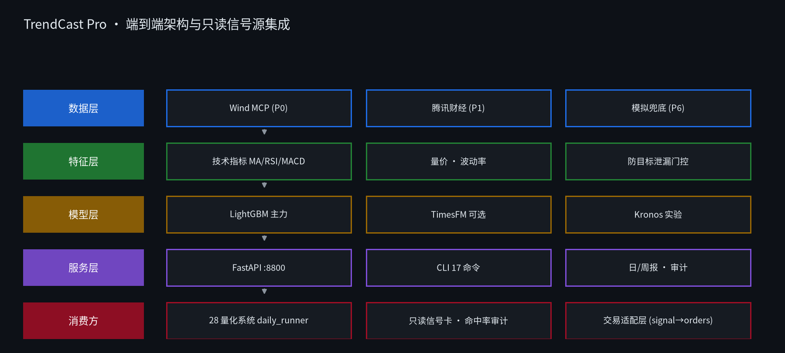
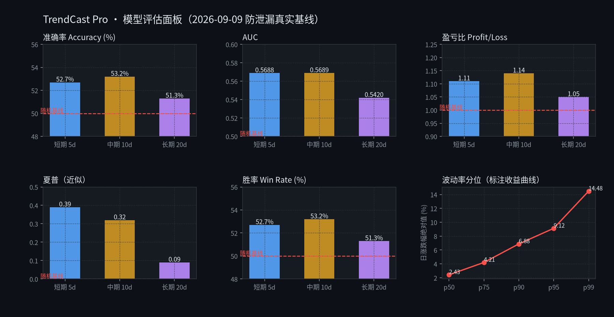
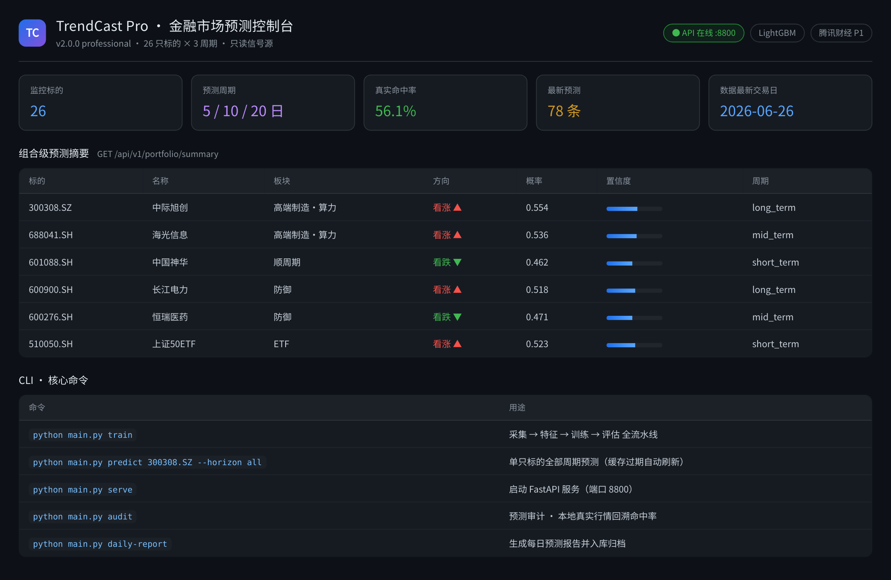

<!-- ═══════════════════════════════════════════════════════════════════════ -->
<!--                              README.md                                  -->
<!--                   Financial Modeling · 金融建模                        -->
<!-- ═══════════════════════════════════════════════════════════════════════ -->

<div align="center">

# 💹 Financial Modeling

### 金融建模 · 量化研究工程仓库

<p>
  <b>TrendCast Pro</b> — 基于 LightGBM 梯度提升树的智能金融预测引擎<br/>
  <sub>多周期方向预测 · 真实行情数据链路 · 命中率审计 · 只读信号源集成</sub>
</p>

<sub>研究与工程实践用途 · 非商业许可 · 不构成投资建议 · 信号仅作观测参考</sub>

</div>

---

<div align="center">

<!-- ── 项目与状态 ── -->
<a href="./LICENSE"></a>


<br/>

<!-- ── 技术栈 ── -->


<br/>

<!-- ── 数据源与执行 ── -->


</div>

---

## 📑 目录

| | |
|---|---|
| [🚀 项目速览](#-项目速览) | [🧩 架构总览](#-架构总览) |
| [📊 模型评估](#-模型评估) | [⚡ 快速开始](#-快速开始) |
| [🖥️ 控制台与接口](#️-控制台与接口) | [📦 仓库内容](#-仓库内容) |
| [🔗 与主系统集成](#-与主系统集成) | [🔒 许可证与免责声明](#-许可证与免责声明) |

---

## 🚀 项目速览

**TrendCast Pro** 是一款面向金融市场的智能预测引擎，通过 LightGBM 梯度提升树对 **A股股票 / ETF / 期货 / 外汇** 的未来走势进行多周期方向性二分类预测（看涨 / 看跌），现已完整集成至主量化策略系统的每日工作流。

<table>
<tr>
<td width="50%" valign="top">

**🎯 核心能力**

- **市场覆盖** — 26 只标的（12 个股 + 14 ETF），对齐主系统持仓池
- **多周期预测** — 短期 5 日 · 中期 10 日 · 长期 20 日
- **模型架构** — LightGBM 主力，TimesFM / Kronos 可选实验路径
- **特征工程** — MA / RSI / MACD / 布林带 · 量价 · 波动率
- **双维评估** — ML 指标（Accuracy / AUC / F1）+ 金融指标（胜率 / 夏普 / 盈亏比）
- **标签与因子** — 三重障碍法标签 A/B（S12/G2）· qlib Alpha158 对齐（S13/G3）

</td>
<td width="50%" valign="top">

**🛡️ 工程纪律**

- **数据源降级链** — Wind MCP → 腾讯财经 → 模拟兜底，逐级优雅降级
- **防目标泄漏** — `get_feature_columns` 强制排除 `target_*` 列
- **数据卫生** — 模拟兜底数据**绝不落盘**，不污染真实历史
- **每日自动刷新** — 推理缓存过期经真实源刷新一次（fail-open）
- **只读信号源** — 只出方向与概率，决策权归主系统
- **试验登记** — `trials` append-only，研究者自由度透明化（S13）
- **发布态检查** — `release-check` 收敛阻塞项与告警路由（S14）
- **调参与门槛** — optuna 超参搜索 + 置信度阈值曲线（S15/G5）；真实池 60-trials 收敛复跑 + 独立保留期阈值复验已完成；**T15.3 双指标门禁结构重构已交付**（`python main.py confidence-gate`，决策单 `reports/confidence_gate_decision.json`，`affects_gate=false`，**是否切换门禁结构待人工签字**）
<<<<<<< HEAD
- **保留期证据链** — `python main.py confidence-holdout`（S16/T16.3）：决策单证据源 `reports/confidence_holdout_verify.json` 首次有可复现生成命令（训练只用前 70%，保留期从未参与训练/扫描/调参）；同时把保留期切成 n 个互不重叠时段做滚动复验（`--no-rolling` 可关），检验 thr∈[0.2,0.3] 命中率优势是否跨时段稳定，stable/unstable/insufficient 三态如实输出（`reports/confidence_rolling_verify.json`，补充证据）；`affects_gate=false`，挑阈值与签字仍属人工检查点
=======
- **概率区间校准** — 保形预测给覆盖率保证（S16/H1）：`python main.py conformal`；多时段滚动保留期复验**未能复现** T15.3 的单时段结论，如实入库
- **过拟合审计** — CPCV 净化交叉验证 + 统一试验预算 + 历史读数回算（S17/H2）：`python main.py overfit-audit`
- **市场状态分层** — HMM 牛/熊/震荡识别 + 状态内评估（S18/H3）：`python main.py regime`；实测**熊市命中率 62.55% vs 震荡市 48.72%（差 13.83pp）**
- **概率校准层** — isotonic / Platt 校准 + API 追加 `calibrated_probability` / `uncertainty`（S19/H4）：`python main.py calibration`；实测 **ECE 0.104 → 0.0025**
- **投研辅助只读接入** — LLM 投研结论只挂报告层，**结构性不进信号路径**（S20/H5）：`python main.py research-assist`；评估结论为无候选满足准入，**默认取消**
>>>>>>> bb4e5c3 (feat(s16-s20): 高质量项目集成2 自动任务落地)

</td>
</tr>
</table>

> 📖 **详细说明**（产品介绍、快速开始、命令行接口、配置、模块详解等）请参阅 → [**16_金融市场预测模型/README.md**](16_金融市场预测模型/README.md)

---

## 🧩 架构总览

<div align="center">
  
</div>

<br/>

**端到端流水线**

```text
数据采集 ──▶ 特征工程 ──▶ 模型训练 ──▶ 评估 ──▶ 导出 ──▶ 服务 ──▶ 报告
   │            │             │          │        │        │        │
 Wind       技术指标      LightGBM    双维指标   ONNX   FastAPI   日/周报
 腾讯      量价波动       集成模型    泄漏检查   运行时  :8800     审计归档
 模拟      防泄漏门控     TimesFM                            命中率回溯
```

**数据源优先级链**（逐级降级，永不崩溃）

```text
Wind MCP (P0)  ──▶  akshare (P1)  ──▶  腾讯财经 (P1)  ──▶  模拟数据 (P6)
   需 Key          免费 · 覆盖期货/外汇     免费 · 前复权       仅链路验证 · 不落盘
```

> akshare 由可选依赖升为 P1（S14/G4），是免费档中**唯一覆盖国内期货与外汇**的通道；未安装时静默跳过，链路与升级前一致。

---

## 📊 模型评估

<div align="center">
  
</div>

<br/>

**最新训练评估**（2026-09-09 · 腾讯财经真实行情 · 目标泄漏已修复）

> 数据口径：主系统持仓池 26 只标的（12 个股 + 14 ETF），腾讯财经前复权日K，2020-01-01 ~ 2026-09-09，按时间三段切分。

| 模型周期 | 准确率 | AUC | 胜率 | 盈亏比 | 夏普（近似） | 评级 |
|:---|:---:|:---:|:---:|:---:|:---:|:---|
| 🟦 短期 5d | 52.7% | 0.5688 | 52.7% | 1.11 | 0.39 | 弱（略优于随机） |
| 🟨 中期 10d | 53.2% | 0.5689 | 53.2% | 1.14 | 0.32 | 弱（略优于随机） |
| 🟪 长期 20d | 51.3% | 0.5420 | 51.3% | 1.05 | 0.09 | 接近随机 |

> ⚠️ **重要提示**：早期评估（2026-06-27，10d/20d AUC 0.84）存在**目标泄漏**（`target` 列曾混入特征集）与模拟数据口径问题，属虚高值，**不可比**。上表为修复后的真实可信基线。
>
> 🧭 **结论**：真实行情下三周期区分度均有限（AUC 0.54~0.57），信号仅可作**只读观测参考**，不可单独作为交易依据。

**命中率审计** · 78 条预测已到期记录 → 57 条经本地真实行情回溯 → **真实命中率 56.1%**（21 条本地无行情保持未验证，绝不误判）

---

## ⚡ 快速开始

### 1 · 安装

```bash
git clone https://cnb.cool/yuppiez328/Financial_Modeling.git
cd Financial_Modeling

python -m venv .venv
source .venv/bin/activate          # Windows: .venv\Scripts\activate
pip install -r requirements.txt
```

> 要求 Python ≥ 3.8（实际运行环境 3.8.9，代码全链路兼容）。
> 使用 Wind 数据源需配置 `WIND_API_KEY`；不用 Wind 时自动使用**腾讯财经免费日K（无需 Key）**。

### 2 · 训练

```bash
python main.py train
```

自动完成 **采集 → 特征 → 训练 → 评估**，产出 `models/lightgbm_{short,mid,long}_term_*.pkl` 与 `logs/evaluation_report.txt`。

### 3 · 预测

```bash
python main.py predict 300308.SZ --horizon all            # 单只 · 全部周期
python main.py batch 600519.SH 000858.SZ --horizon mid_term
```

### 4 · 启动 API 服务

```bash
python main.py serve                                       # http://localhost:8800
```

### 5 · 常用扩展

```bash
python main.py daily-report     # 每日预测报告
python main.py weekly-report    # 周度预测报告
python main.py adaptive         # 自适应学习（性能监控 + 漂移检测）
python main.py audit            # 预测审计（真实行情回溯命中率）
python main.py schedule         # 自动重训练调度（常驻）
```

> 📌 完整命令与配置请参见 → [**16_金融市场预测模型/README.md**](16_金融市场预测模型/README.md)

---

## 🖥️ 控制台与接口

<div align="center">
  
  <br/>
  <sub>▲ 组合级预测摘要与 CLI 命令速查（示例渲染视图）</sub>
</div>

<br/>

**REST API**（FastAPI · 默认端口 8800）

| 方法 | 端点 | 说明 |
|:---:|:---|:---|
| `GET` | `/health` | 健康检查 |
| `GET` | `/api/v1/models` | 已加载模型清单 |
| `GET` | `/api/v1/predict/{symbol}` | 单只预测（`?horizon=`） |
| `POST` | `/api/v1/predict/batch` | 批量预测 |
| `GET` | **`/api/v1/portfolio/summary`** | **组合级契约端点（主系统每日消费）** |
| `GET` | `/api/v1/signal/{symbol}` | 交易信号 |
| `GET` | `/api/v1/trade/{symbol}` | 交易适配输出 |
| `GET` | `/api/v1/audit/report` | 审计报告 |
| `GET` | `/api/v1/audit/stats` | 命中率统计 |

```bash
# 组合级摘要（主系统 daily_runner 步骤 2.5 每日自动调用）
curl "http://localhost:8800/api/v1/portfolio/summary?symbols=300308.SZ,601088.SH"

# 契约返回
# {"generated_at", "model_type", "predictions":[{symbol, sector,
#   horizons:{h:{direction, probability, model}}}], "meta":{models_loaded, error_symbols}}
```

---

## 📦 仓库内容

| 目录 | 说明 | 状态 |
|:---|:---|:---:|
| [**16_金融市场预测模型**](16_金融市场预测模型/) | **TrendCast Pro** — 多周期方向预测 + 真实数据链路 + 命中率审计 |  |
| └ [**assets/readme**](assets/readme/) | 本 README 的 4 张预览图（架构 / 评估 / 数据链路 / 控制台） |  |
| [**LICENSE**](LICENSE) | 禁止商业用途许可协议（Non-Commercial） |  |

> 📌 **本仓库当前仅发布 `16_金融市场预测模型` 一个项目。** 子项目内部含 `configs/`、`src/`、`tests/`、`Kronos/`（第三方快照）等目录，详见 [子项目 README](16_金融市场预测模型/README.md#四项目结构)。
>
> 🚧 其余历史目录（`01_数据源与数据处理`、`04_交易与套保执行`、`09_配置与依赖`、`13_超算业务系统`）**未纳入本仓库版本库**，后续整理完成后另行发布，此处不作链接以免失效。

---

## 🔗 与主系统集成

本仓库作为 **只读信号源**，与外部独立仓库 **28-终极量化交易系统8.4**（不在本仓库内，故不作链接）通过 REST 对接。

> **设计原则：本系统只出方向与概率，主系统独享决策权。**（一期只读注入，不改变主系统任何下单 / 调仓行为）

| 组件 | 职责 |
|:---|:---|
| **客户端** | 健康检查 · 组合摘要 · 读取主系统持仓（fail-open，服务不可达即跳过） |
| **审计** | JSONL 落盘 + 本地真实行情回溯 + 命中率 / 漂移告警 |
| **接线** | `daily_runner.py` 步骤 2.5 — 拉取 → 审计 → 信号卡片 → 每日报告 |

**验证状态**（2026-09-09 E2E 冒烟通过）

- ✅ **正路径** — 26 标的 × 3 周期 = 78 条真实预测（概率 43%~55%，脱离 0.5 兜底）
- ✅ **命中率链路** — 78 条到期记录 → 57 条被真实行情回溯 → **真实命中率 56.1%**
- ✅ **fail-open** — 本系统服务关闭 → 主系统优雅跳过，主流程零中断
- ✅ **数据卫生** — 模拟时代旧审计记录已清除

---

## 🔒 许可证与免责声明

### 许可证

本项目采用 **禁止商业用途许可协议（Non-Commercial License）**，详见 [LICENSE](LICENSE)。

| | 条款 |
|:---:|:---|
| ✅ | **允许** — 学习、研究、教学、学术、非商业内部评估用途 |
| ❌ | **禁止** — 一切商业用途，包括商业产品 / 服务、金融机构对外产品、以营利为目的的量化交易或信号售卖 |
| ❌ | **禁止** — 转售、出租、分发牟利、再许可、去除版权标识 |
| 🔒 | **商用授权** — 须事先取得版权方（yuppiez328 / 安然）的书面许可 |

### 免责声明

本软件仅供学习、研究和非商业用途使用，按"现状"（AS IS）提供，**不构成任何投资建议**。金融市场具有高度不确定性，任何模型的历史表现均不代表未来收益。使用者应自行承担一切投资风险与合规责任。

---

<div align="center">

<br/>

**Copyright © 2026 [yuppiez328（安然）](https://cnb.cool/yuppiez328) — 保留所有权利**

<sub>用数据说话 · 用量化决策 · 用纪律执行</sub>

<br/>


</div>
